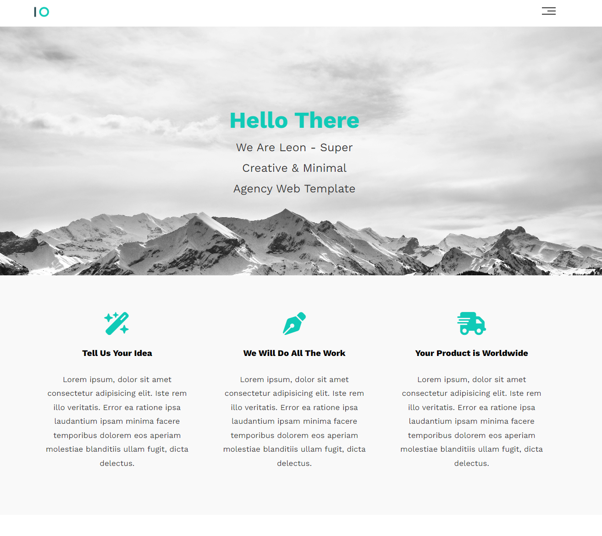

# Project Title				
  "Responsive HTML and CSS Template - 1"

## Description				
A responsive webpage template using HTML and CSS , following tutorials on Elzero Web School YT Channel.				
				
## Features				
- Multiple sections.			
- Responsive Design.
				
				
## Technologies Used				
- HTML				
- CSS 
 -- Basic CSS	
 -- Layout: Flexbox, Grid.		
 -- Styling: Positioning, Box styling, CSS Variables.					
 -- Responisveness: Media Queries, Responsive Web Designs.					
 -- Advanced Selectors and Global Variables.							
 				
				
## Demo 
[View Demo on Awesome Screenshot]
(https://www.awesomescreenshot.com/video/34019124?key=ae670fcf978babfe064ee249e7a90365)
				
				
## Screenshots				
Screenshots are avaialable in the `Screenshots` folder.
Here's an example:
 				
				
## How to Use				
1. Clone the repository.				
2. Open `index.html` in your browser to view the project.				
				
				
